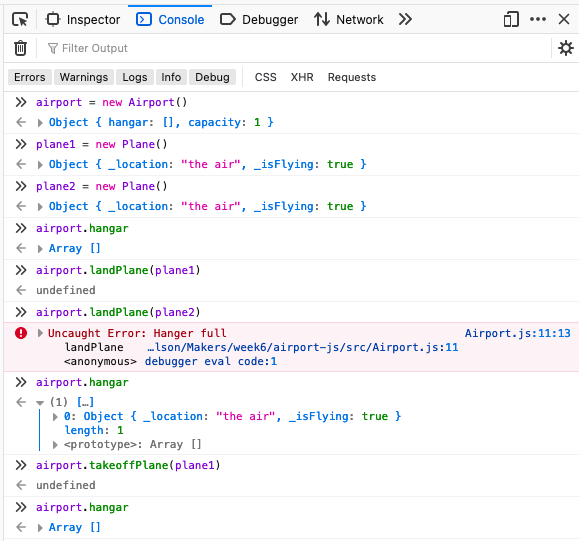

## Airport Challenge (JavaScript)

A command line air traffic control system, in JavaScript. This was a pair programming challenge for the 6th week of the [Makers Academy](https://makers.tech) coding bootcamp.  

### Description
We were given the same user stories as for our Ruby [Airport Challenge](https://github.com/mscwilson/airport-challenge), but to write it in JavaScript. The goal was to learn both JavaScript and the Jasmine testing library.  
The user stories:
```
As an air traffic controller 
So I can get passengers to a destination 
I want to instruct a plane to land at an airport

As an air traffic controller 
So I can get passengers on the way to their destination 
I want to instruct a plane to take off from an airport and confirm that it is no longer in the airport

As an air traffic controller 
To ensure safety 
I want to prevent landing when the airport is full 

As the system designer
So that the software can be used for many different airports
I would like a default airport capacity that can be overridden as appropriate

As an air traffic controller 
To ensure safety 
I want to prevent takeoff when weather is stormy 

As an air traffic controller 
To ensure safety 
I want to prevent landing when weather is stormy 
```
The code was written using pair programming between me and [Petar](https://github.com/PetarSimonovic).  
We tried a different approach from my Ruby airport where Planes had most of the functionality, and instead started with an Airport class. Airports land and take off Planes, and also randomly have bad weather.  

### Installation and Usage
To try out the project:
* Open `SpecRunner.html` in your browser
* The test results will be shown on the left
* Use the browser's Developer Tools Console as a REPL
  * In Firefox: Tools > Web Developer > Web Developer Tools > Console tab
  * In Chrome: View > Developer > Developer Tools > Console tab  

Here's a screenshot of the code in action:  
  


### Known Issues
At the moment the Airport doesn't change the Plane attributes, so the Plane doesn't know it's landed.
